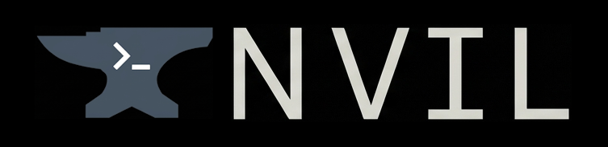

<div align="center">



<i>A portable, containerized terminal-first development environment built on Rhel Family. <br/> Start coding immediately without configuring a new machine.</i>


</div>

# NVIL

<!--toc:start-->

- [NVIL](#nvil)
  - [Requirements](#requirements)
  - [Quick Start](#quick-start)
  - [Features](#features)
  - [NVIL vs Dev Containers](#nvil-vs-dev-containers)
  - [Architecture](#architecture)
  - [Usage](#usage)
    - [Environment Variables](#environment-variables)
    - [Setup](#setup)
    - [Lifecycle Commands](#lifecycle-commands)
  - [Build Your Own Flavor](#build-your-own-flavor)
  - [Available Tools in Full Flavor](#available-tools-in-full-flavor)
  - [Project Structure](#project-structure)
  - [Contributing](#contributing)
  - [License](#license)

<!--toc:end-->

## Requirements

| Tool                                    | Description       | Install                                                           |
| --------------------------------------- | ----------------- | ----------------------------------------------------------------- |
| [just](https://github.com/casey/just)   | Command runner    | `brew install just` / `cargo install just` / `scoop install just` |
| [podman](https://podman.io) (or docker) | Container runtime | [Install podman](https://podman.io/getting-started/installation)  |

## Quick Start

```bash
cd /path/to/your-projects-workspace

# Download sample files
curl -fsSL https://raw.githubusercontent.com/thomaschampagne/nvil/main/.nvil.yaml -o .nvil.yaml
curl -fsSL https://raw.githubusercontent.com/thomaschampagne/nvil/main/.env.sample -o .env

# Edit .env with your info and preferences
vi .env

# Launch
just connect
```

You're in a fully configured dev environment. See [Usage](#usage) for details.

## Features

- **Terminal-first workspace** - ZSH, Zellij multiplexer, Helix/Neovim, Yazi file manager, and keyboard-driven tools out of the box
- **Pre-built images** - No waiting for container builds; pull `ghcr.io/thomaschampagne/nvil-core` or `nvil-full` and go
- **Cross-project workspace** - Mount your entire projects directory, not just one repo at a time
- **Extensible via "feats"** - Add languages, runtimes, and tools via `dnf`, [mise](https://mise.jdx.dev/), or [Homebrew](https://brew.sh/)
- **Editor agnostic** - Works with any modal editor; connect your IDE via SSH to the container
- **95+ pre-configured tools** - Git, ripgrep, fzf, kubectl, trivy, lazygit, btop, and more

## NVIL vs Dev Containers

|            | Dev Containers                     | NVIL                                                            |
| ---------- | ---------------------------------- | --------------------------------------------------------------- |
| Scope      | Per-project (`.devcontainer.json`) | Per-project and **cross-project**, and **personal environment** |
| Editor     | VS Code / JetBrains only           | Any modal editor, or connect your IDE via SSH                   |
| Base image | Built from scratch each time       | Pre-built, layered on Fedora                                    |
| Workflow   | Attach to container per project    | Access all projects from your mounted workspace                 |

## Architecture

```text
┌─────────────────────────────────────────────────┐
│                   Your Host                     │
│  ┌─────────────┐     ┌──────────────────────┐   │
│  │  Projects   │     │   .nvil.yaml +       │   │
│  │  Directory  │ --> │   .nvil.env          │   │
│  └─────────────┘     └──────────────────────┘   │
│         ▲                      │                │
│         |                      ▼                │
│  ┌──────────────────────────────────────────┐   │
│  │       Container (Docker / Podman)        │   │
│  │  ┌────────────────────────────────────┐  │   │
│  │  │  Fedora Base (nvil-core)           │  │   │
│  │  │  ZSH · Zellij · Git · Core Tools   │  │   │
│  │  └────────────────────────────────────┘  │   │
│  │  ┌────────────────────────────────────┐  │   │
│  │  │  Flavor Layer (nvil-full)          │  │   │
│  │  │  Go · Node · Bun · k9s · Trivy ... │  │   │
│  │  └────────────────────────────────────┘  │   │
│  └──────────────────────────────────────────┘   │
└─────────────────────────────────────────────────┘
```

| Component          | Description                                                |
| ------------------ | ---------------------------------------------------------- |
| `core/`            | Base Fedora image with shell, git, editors                 |
| `feats/`           | Installable tool modules (languages, runtimes, tools, ...) |
| `flavors/`         | Dockerfiles that layer feats onto core                     |
| `nvil.img.make.sh` | Build script for custom images                             |

## Usage

### Environment Variables

Copy and edit the sample:

```bash
cp .env.sample .env
```

| Variable                   | Default                                    | Description                         |
| -------------------------- | ------------------------------------------ | ----------------------------------- |
| `NVIL_CONTAINER_NAME`      | `nvil`                                     | Container name and hostname         |
| `NVIL_IMAGE`               | `ghcr.io/thomaschampagne/nvil-full:latest` | Image to use                        |
| `NVIL_WORKSPACE_HOST_PATH` | `.`                                        | Host path mounted as `/workspace`   |
| `NVIL_GIT_USER_NAME`       | `Smith Black`                              | Git user name                       |
| `NVIL_GIT_USER_EMAIL`      | `smith.black@dev.local`                    | Git user email                      |
| `NVIL_DEFAULT_EDITOR`      | `hx`                                       | Default editor (`hx`, `nvim`, etc.) |
| `TZ`                       | `Europe/Paris`                             | Timezone                            |

### Setup

Create `.nvil.yaml` in your workspace directory (e.g., `/home/user/Projects/.nvil.yaml`):

```yaml
# yaml-language-server: $schema=https://raw.githubusercontent.com/compose-spec/compose-go/master/schema/compose-spec.json
services:
  nvil:
    container_name: ${NVIL_CONTAINER_NAME:-nvil}
    image: ${NVIL_IMAGE:-ghcr.io/thomaschampagne/nvil-full:latest}
    hostname: ${NVIL_CONTAINER_NAME:-nvil}
    restart: unless-stopped
    env_file:
      - .env
    working_dir: /workspace
    volumes:
      - .:/workspace:delegated
    network_mode: host
    cap_add:
      - NET_RAW
    stdin_open: true
    tty: true
```

### Lifecycle Commands

```bash
# Start and connect (auto-starts podman machine if needed)
just connect

# Stop (preserves container state)
just stop

# Destroy container
just delete
```

## Build Your Own Flavor

Use `flavors/full.Dockerfile` as a blueprint. Pick the feats you want, then build:

```bash
sh nvil.img.make.sh \
  --docker-file=./flavors/my-flavor.Dockerfile \
  --image=nvil-my-flavor:latest \
  --gh-token=$GITHUB_TOKEN
```

Add feats by copying install scripts into `feats/<category>/<name>/` and referencing them in your Dockerfile:

```dockerfile
COPY --parents --chown=${NVIL_USER}:${NVIL_USER} ./feats/tools/my-tool /nvil/.tmp/
```

Run `sh nvil.img.make.sh --help` for all options.

## Available Tools in Full Flavor

NVIL ships with many tools across core and pickable categories. View the full list inside a running container:

```bash
nvil --list
```

| Scope | Category        | Name                              | Version       | Description                                                                          | Licence      | Repo                                                                       | Manager |
| ----- | --------------- | --------------------------------- | ------------- | ------------------------------------------------------------------------------------ | ------------ | -------------------------------------------------------------------------- | ------- |
| core  | development     | gcc                               | 15.2.1        | GNU compiler collection                                                              | GPL-3.0      | <https://gcc.gnu.org/>                                                     | dnf     |
| core  | development     | git                               | 2.53.0        | Distributed version control system                                                   | GPL-2.0      | <https://github.com/git/git>                                               | dnf     |
| core  | development     | helix                             | 25.07.1       | Post-modern modal text editor                                                        | MPL-2.0      | <https://github.com/helix-editor/helix>                                    | mise    |
| core  | development     | lazygit                           | 0.60.0        | Simple terminal UI for git commands                                                  | MIT          | <https://github.com/jesseduffield/lazygit>                                 | mise    |
| core  | development     | nano                              | 8.5           | Text editor. An enhanced pico clone                                                  | GPL-3.0      | <https://www.nano-editor.org/>                                             | dnf     |
| core  | development     | neovim                            | 0.12.0        | Ambitious Vim-fork focused on extensibility and agility                              | Apache-2.0   | <https://github.com/neovim/neovim>                                         | mise    |
| core  | development     | vim-enhanced                      | 9.2.280       | Vi IMproved, a programmer's text editor with enhanced features                       | VIM          | <https://github.com/vim/vim>                                               | dnf     |
| core  | filesystem      | yazi                              | 26.1.22       | Blazing fast terminal file manager written in Rust                                   | MIT          | <https://github.com/sxyazi/yazi>                                           | mise    |
| core  | font            | jetbrains-mono-fonts              | 2.304         | Monospaced font designed for developers by JetBrains                                 | OFL-1.1      | <https://github.com/JetBrains/JetBrainsMono>                               | dnf     |
| core  | formatter       | dprint                            | 0.53.2        | Pluggable and configurable code formatting platform written in Rust                  | MIT          | <https://github.com/dprint/dprint>                                         | mise    |
| core  | formatter       | shfmt                             | 3.13.0        | Shell parser, formatter, and interpreter                                             | BSD-3-Clause | <https://github.com/mvdan/sh>                                              | mise    |
| core  | formatter       | taplo                             | 0.10.0        | TOML toolkit written in Rust                                                         | MIT          | <https://github.com/tamasfe/taplo>                                         | mise    |
| core  | language-server | bash-language-server              | 5.6.0         | Bash language server using tree-sitter for parsing                                   | MIT          | <https://github.com/bash-lsp/bash-language-server>                         | pnpm    |
| core  | language-server | emmet-ls                          | 0.4.2         | Emmet support for LSP-compatible editors                                             | MIT          | <https://github.com/aca/emmet-ls>                                          | pnpm    |
| core  | language-server | marksman                          | 2026-02-08    | Language Server Protocol for Markdown                                                | MIT          | <https://github.com/artempyanykh/marksman>                                 | mise    |
| core  | language-server | vscode-langservers-extracted      | 4.10.0        | Extracted language servers from VSCode for HTML, CSS, and JSON                       | MIT          | <https://github.com/hrsh7th/vscode-langservers-extracted>                  | pnpm    |
| core  | language-server | vscode-xml                        | 0.29.0        | XML language server from VSCode                                                      | EPL-2.0      | <https://github.com/redhat-developer/vscode-xml>                           | mise    |
| core  | language-server | yaml-language-server              | 1.21.0        | YAML language server with validation and completion                                  | MIT          | <https://github.com/redhat-developer/yaml-language-server>                 | pnpm    |
| core  | monitoring      | btop                              | 1.4.6         | Resource monitor that shows CPU, memory, disks, network, and processes               | Apache-2.0   | <https://github.com/aristocratos/btop>                                     | dnf     |
| core  | monitoring      | fastfetch                         | 2.60.0        | Display information about your operating system, software, and hardware              | MIT          | <https://github.com/fastfetch-cli/fastfetch>                               | dnf     |
| core  | monitoring      | strace                            | 6.19          | Trace system calls and signals                                                       | LGPL-2.1     | <https://github.com/strace/strace>                                         | dnf     |
| core  | network         | netcat                            | 1.237         | Utility for managing network connections                                             | GPL-2.0      | <https://sourceforge.net/projects/netcat/>                                 | dnf     |
| core  | network         | tcpdump                           | 4.99.6        | Dump traffic on a network                                                            | BSD-3-Clause | <https://github.com/the-tcpdump-group/tcpdump>                             | dnf     |
| core  | network         | traceroute                        | 2.1.6         | Trace the route IP packets take to a host                                            | GPL-2.0      | <https://sourceforge.net/projects/traceroute/>                             | dnf     |
| core  | network         | wget2-wget                        | 2.2.1         | Non-interactive network downloader (wget2 variant)                                   | GPL-3.0      | <https://gitlab.com/gnuwget/wget2>                                         | dnf     |
| core  | package-manager | npm                               | 11.11.0       | JavaScript and Node.js package manager                                               | Artistic-2.0 | <https://github.com/npm/cli>                                               | npm     |
| core  | package-manager | pnpm                              | 10.33.0       | Fast, disk space efficient package manager                                           | MIT          | <https://github.com/pnpm/pnpm>                                             | mise    |
| core  | runtimes        | node                              | 24.14.1       | Open-source, cross-platform JavaScript runtime environment                           | MIT          | <https://github.com/nodejs/node>                                           | mise    |
| core  | security        | nmap                              | 7.92          | Network exploration tool and security/port scanner                                   | Nmap         | <https://github.com/nmap/nmap>                                             | dnf     |
| core  | security        | openssl                           | 3.5.4         | OpenSSL cryptographic toolkit                                                        | Apache-2.0   | <https://github.com/openssl/openssl>                                       | dnf     |
| core  | shell           | zellij                            | 0.44.0        | Pluggable terminal workspace, with terminal multiplexer as the base feature          | MIT          | <https://github.com/zellij-org/zellij>                                     | mise    |
| core  | shell           | zsh                               | 5.9           | Z SHell, a Bash-compatible command-line interpreter                                  | MIT          | <https://www.zsh.org/>                                                     | dnf     |
| core  | system          | dos2unix                          | 7.5.3         | Convert text between DOS, UNIX, and Mac formats                                      | BSD-2-Clause | <https://waterlan.home.xs4all.nl/dos2unix.html>                            | dnf     |
| core  | system          | gzip                              | 1.13          | GNU compression utility                                                              | GPL-3.0      | <https://www.gnu.org/software/gzip/>                                       | dnf     |
| core  | system          | jq                                | 1.8.1         | Lightweight and flexible command-line JSON processor                                 | MIT          | <https://github.com/jqlang/jq>                                             | dnf     |
| core  | system          | rsync                             | 3.4.1         | Fast incremental file transfer utility                                               | GPL-3.0      | <https://github.com/WayneD/rsync>                                          | dnf     |
| core  | system          | tree                              | 2.2.1         | Display directories as trees                                                         | GPL-2.0      | <https://gitlab.com/OldManProgrammer/unix-tree>                            | dnf     |
| core  | system          | unzip                             | 6.0           | Extract, test, and list ZIP files                                                    | Info-ZIP     | <https://sourceforge.net/projects/infozip/>                                | dnf     |
| core  | system          | wl-clipboard                      | 2.2.1         | Command-line copy/paste utilities for Wayland                                        | GPL-3.0      | <https://github.com/bugaevc/wl-clipboard>                                  | dnf     |
| core  | system          | xclip                             | 0.13          | Command line interface to X selections (clipboard)                                   | GPL-2.0      | <https://github.com/astrand/xclip>                                         | dnf     |
| core  | system          | xsel                              | 1.2.1         | Access X clipboard from the command line                                             | GPL-2.0      | <https://github.com/kfish/xsel>                                            | dnf     |
| core  | system          | yq                                | 4.47.1        | Lightweight and portable command-line YAML processor                                 | MIT          | <https://github.com/mikefarah/yq>                                          | dnf     |
| pick  | ai              | opencode                          | 1.3.15        | AI coding assistant for the terminal                                                 | MIT          | <https://github.com/anomalyco/opencode>                                    | mise    |
| pick  | backups         | restic                            | 0.18.1        | Fast, secure, efficient backup program                                               | BSD-2-Clause | <https://github.com/restic/restic>                                         | mise    |
| pick  | development     | delta                             | 0.19.2        | A syntax-highlighting pager for git, diff, grep, and blame output                    | MIT          | <https://github.com/dandavison/delta>                                      | mise    |
| pick  | development     | hyperfine                         | 1.20.0        | A command-line benchmarking tool                                                     | Apache-2.0   | <https://github.com/sharkdp/hyperfine>                                     | mise    |
| pick  | development     | just                              | 1.49.0        | Just a command runner                                                                | CC0-1.0      | <https://github.com/casey/just>                                            | mise    |
| pick  | development     | miniserve                         | 0.33.0        | For when you really just want to serve some files over HTTP right now                | MIT          | <https://github.com/svenstaro/miniserve>                                   | mise    |
| pick  | development     | serpl                             | 0.3.4         | A simple terminal UI for search and replace, ala VS Code                             | MIT          | <https://github.com/yassinebridi/serpl>                                    | mise    |
| pick  | development     | tokei                             | 14.0.0        | A program that displays statistics about your code                                   | Apache-2.0   | <https://github.com/XAMPPRocky/tokei>                                      | brew    |
| pick  | devops          | helm                              | 4.1.3         | The package manager for Kubernetes                                                   | Apache-2.0   | <https://github.com/helm/helm>                                             | mise    |
| pick  | devops          | k9s                               | 0.50.18       | Kubernetes CLI to manage your clusters                                               | Apache-2.0   | <https://github.com/derailed/k9s>                                          | mise    |
| pick  | devops          | kubectl                           | 1.35.3        | Kubernetes command-line tool                                                         | Apache-2.0   | <https://github.com/kubernetes/kubernetes>                                 | mise    |
| pick  | filesystem      | 7zip                              | 26.00         | File archiver with a high compression ratio                                          | LGPL-2.1     | <https://github.com/ip7z/7zip>                                             | mise    |
| pick  | filesystem      | bat                               | 0.26.1        | A cat clone with syntax highlighting and Git integration                             | Apache-2.0   | <https://github.com/sharkdp/bat>                                           | mise    |
| pick  | filesystem      | dua                               | 2.34.0        | A tool to conveniently learn about the disk usage of directories, fast               | MIT          | <https://github.com/Byron/dua-cli>                                         | mise    |
| pick  | filesystem      | duf                               | 0.9.1         | Disk Usage/Free Utility - a better df alternative                                    | MIT          | <https://github.com/muesli/duf>                                            | mise    |
| pick  | filesystem      | eza                               | 0.23.4        | A modern replacement for ls                                                          | EUPL-1.2     | <https://github.com/eza-community/eza>                                     | mise    |
| pick  | filesystem      | jdupes                            | 1.31.1        | A powerful duplicate file finder and an enhanced fork of fdupes                      | MIT          | <https://github.com/jbruchon/jdupes>                                       | brew    |
| pick  | filesystem      | rip2                              | 0.9.6         | A safer, ergonomic alternative to rm                                                 | GPL-3.0      | <https://github.com/MilesCranmer/rip2>                                     | mise    |
| pick  | filesystem      | tre                               | 0.4.0         | A modern alternative to the tree command                                             | MIT          | <https://github.com/dduan/tre>                                             | mise    |
| pick  | formatter       | prettier                          | 3.8.1         | Opinionated code formatter for JavaScript, CSS, JSON, GraphQL, Markdown, YAML        | MIT          | <https://github.com/prettier/prettier>                                     | pnpm    |
| pick  | language        | go                                | 1.26.1        | Open source programming language to build simple/reliable/efficient software         | BSD-3-Clause | <https://github.com/golang/go>                                             | mise    |
| pick  | language        | typescript                        | 6.0.2         | Typed superset of JavaScript that compiles to plain JavaScript                       | Apache-2.0   | <https://github.com/microsoft/TypeScript>                                  | pnpm    |
| pick  | language-server | dockerfile-language-server-nodejs | 0.15.0        | Dockerfile language server for syntax highlighting and validation                    | MIT          | <https://github.com/rcjsuen/dockerfile-language-server-nodejs>             | pnpm    |
| pick  | language-server | typescript-language-server        | 5.1.3         | TypeScript/JavaScript language server using tsserver                                 | MIT          | <https://github.com/typescript-language-server/typescript-language-server> | pnpm    |
| pick  | monitoring      | bandwhich                         | 0.23.1        | Terminal bandwidth utilization tool                                                  | MIT          | <https://github.com/imsnif/bandwhich>                                      | mise    |
| pick  | monitoring      | procs                             | 0.14.11       | A modern replacement for ps written in Rust                                          | MIT          | <https://github.com/dalance/procs>                                         | mise    |
| pick  | network         | doggo                             | 1.1.5         | Modern DNS client for humans                                                         | GPL-3.0      | <https://github.com/mr-karan/doggo>                                        | mise    |
| pick  | network         | gping                             | gping-v1.20.1 | Ping, but with a graph                                                               | MIT          | <https://github.com/orf/gping>                                             | mise    |
| pick  | network         | xh                                | 0.25.3        | Friendly and fast tool for sending HTTP requests                                     | MIT          | <https://github.com/ducaale/xh>                                            | mise    |
| pick  | productivity    | tlrc                              | 1.13.0        | Official tldr client written in Rust                                                 | MIT          | <https://github.com/tldr-pages/tlrc>                                       | mise    |
| pick  | productivity    | xan                               | 0.56.0        | Terminal multiplexer with batteries included                                         | Unlicense    | <https://github.com/medialab/xan>                                          | mise    |
| pick  | runtimes        | bun                               | 1.3.11        | Fast all-in-one JavaScript runtime and toolkit                                       | MIT          | <https://github.com/oven-sh/bun>                                           | mise    |
| pick  | search          | fd                                | 10.4.2        | A simple, fast and user-friendly alternative to find                                 | Apache-2.0   | <https://github.com/sharkdp/fd>                                            | mise    |
| pick  | search          | fzf                               | 0.71.0        | A command-line fuzzy finder                                                          | MIT          | <https://github.com/junegunn/fzf>                                          | mise    |
| pick  | search          | navi                              | 2.24.0        | An interactive cheatsheet tool for the command-line                                  | Apache-2.0   | <https://github.com/denisidoro/navi>                                       | mise    |
| pick  | search          | ripgrep                           | 15.1.0        | Recursively searches directories for a regex pattern while respecting your gitignore | Unlicense    | <https://github.com/BurntSushi/ripgrep>                                    | mise    |
| pick  | search          | sd                                | 1.1.0         | Intuitive find and replace CLI (sed alternative)                                     | MIT          | <https://github.com/chmln/sd>                                              | mise    |
| pick  | security        | age                               | 1.3.1         | Simple, modern, and secure encryption tool                                           | BSD-3-Clause | <https://github.com/FiloSottile/age>                                       | mise    |
| pick  | security        | grype                             | 0.110.0       | Vulnerability scanner for container images and filesystems                           | Apache-2.0   | <https://github.com/anchore/grype>                                         | mise    |
| pick  | security        | sops                              | 3.12.2        | Simple and flexible tool for managing secrets                                        | MPL-2.0      | <https://github.com/getsops/sops>                                          | mise    |
| pick  | security        | syft                              | 1.42.3        | Generate Software Bill of Materials (SBOM) from container images and filesystems     | Apache-2.0   | <https://github.com/anchore/syft>                                          | mise    |
| pick  | security        | trivy                             | 0.69.3        | Find and fix container misconfigurations, IaC issues, and vulnerabilities            | Apache-2.0   | <https://github.com/aquasecurity/trivy>                                    | mise    |
| pick  | security        | trufflehog                        | 3.94.2        | Find and verify credentials in your codebase                                         | AGPL-3.0     | <https://github.com/trufflesecurity/trufflehog>                            | mise    |
| pick  | shell           | agg                               | 1.7.0         | Asciicast to GIF converter                                                           | GPL-3.0      | <https://github.com/asciinema/agg>                                         | mise    |
| pick  | shell           | asciinema                         | 3.2.0         | Terminal session recorder, streamer and player                                       | GPL-3.0      | <https://github.com/asciinema/asciinema>                                   | mise    |
| pick  | shell           | chezmoi                           | 2.70.0        | Manage your dotfiles across multiple diverse machines, securely                      | MIT          | <https://github.com/twpayne/chezmoi>                                       | mise    |
| pick  | shell           | glow                              | 2.1.1         | Render markdown on the CLI, with pizzazz                                             | MIT          | <https://github.com/charmbracelet/glow>                                    | mise    |
| pick  | shell           | lnav                              | 0.13.2        | Log file navigator with format detection and color-coded output                      | BSD-2-Clause | <https://github.com/tstack/lnav>                                           | mise    |
| pick  | shell           | oh-my-posh                        | 29.9.2        | The most customisable and low-latency cross platform/shell prompt renderer           | MIT          | <https://github.com/JanDeDobbeleer/oh-my-posh>                             | mise    |
| pick  | shell           | watchexec                         | 2.5.1         | Execute commands when files change                                                   | Apache-2.0   | <https://github.com/watchexec/watchexec>                                   | mise    |
| pick  | shell           | zoxide                            | 0.9.9         | A smarter cd command. Supports all major shells                                      | MIT          | <https://github.com/ajeetdsouza/zoxide>                                    | mise    |
| pick  | system          | hexyl                             | 0.17.0        | A command-line hex viewer                                                            | Apache-2.0   | <https://github.com/sharkdp/hexyl>                                         | mise    |

Total: 95 packages

## Project Structure

```
├── core/                   # Base image: bootstrap, entrypoint, core tools
├── feats/                  # Installable feature modules
│   ├── tools/              # CLI utilities
│   ├── languages/          # Language support (LSP, formatters)
│   ├── runtimes/           # Runtimes (Node, Bun, etc.)
│   └── frameworks/         # Framework-specific tooling
├── flavors/                # Dockerfiles that compose core + feats
├── .github/workflows/      # CI for building and publishing images
├── justfile                # Task runner for lifecycle commands
├── nvil.img.make.sh        # Image build script
├── .env.sample             # Environment template
├── .nvil.yaml              # Compose template (create in your workspace)
└── .dev/                   # Local dev compose files
```

## Contributing

Contributions are welcome. To add a new tool:

1. Create an install script under `feats/<category>/<tool-name>/`
2. Add a `metadata.json` with tool info
3. Reference it in a flavor Dockerfile
4. Test by building the image

See [BACKLOG.md](BACKLOG.md) for planned work.

## License

MIT. See [LICENSE](LICENSE) for details.
