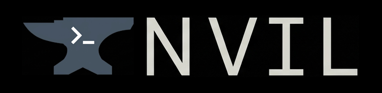

<div align="center">



<i>A portable, containerized terminal-first development environment built on Rhel Family. <br/> Start coding immediately without configuring a new machine.</i>


</div>

# NVIL

<!--toc:start-->

- [NVIL](#nvil)
  - [Requirements](#requirements)
  - [Quick Start](#quick-start)
  - [Features](#features)
  - [NVIL vs Dev Containers](#nvil-vs-dev-containers)
  - [Architecture](#architecture)
  - [Usage](#usage)
    - [Environment Variables](#environment-variables)
    - [Setup](#setup)
    - [Lifecycle Commands](#lifecycle-commands)
  - [Build Your Own Flavor](#build-your-own-flavor)
  - [Available Tools in Full Flavor](#available-tools-in-full-flavor)
  - [Project Structure](#project-structure)
  - [Contributing](#contributing)
  - [License](#license)

<!--toc:end-->

## Requirements

| Tool                                    | Description       | Install                                                           |
| --------------------------------------- | ----------------- | ----------------------------------------------------------------- |
| [just](https://github.com/casey/just)   | Command runner    | `brew install just` / `cargo install just` / `scoop install just` |
| [podman](https://podman.io) (or docker) | Container runtime | [Install podman](https://podman.io/getting-started/installation)  |

### Windows / WSL

NVIL runs on WSL2. **Use the WSL-native `podman`, not the Windows `podman.exe`**
(Windows podman.exe runs a separate engine in its own VM — images built and
containers run there are invisible to WSL and vice versa).

- Enter WSL first (Windows Terminal → your WSL distro, or `wsl.exe`), then run all commands as on Linux.
- From a Windows shell (Git-Bash/MSYS), prefix with `wsl` to reach the WSL engine, e.g. `wsl podman images`. `nvil.img.make.sh` already re-routes itself into WSL2 automatically on Windows.
- Windows-only `podman machine` is not required by NVIL, but if you use it (e.g. to run `podman`/`podman-remote` from the Windows host), it **must be rootful** for images to sync properly between WSL2 and the Windows host:

```bash
# New machine:
podman machine init --rootful --now
# Existing machine:
podman machine set --rootful
podman machine stop
podman machine start
```

A rootful machine exposes `/run/podman/podman.sock`, which is what the Windows host (Podman Desktop / podman-remote) connects to for image sync the same socket `nvil.img.make.sh` relies on.

## Quick Start

```bash
cd /path/to/your-projects-workspace

# Download sample files
curl -fsSL https://raw.githubusercontent.com/thomaschampagne/nvil/main/.nvil.yaml -o .nvil.yaml
curl -fsSL https://raw.githubusercontent.com/thomaschampagne/nvil/main/justfile -o justfile
curl -fsSL https://raw.githubusercontent.com/thomaschampagne/nvil/main/.env.sample -o .env

# Edit .env with your info and preferences
vi .env

# Launch
just connect
```

You're in a fully configured dev environment. See [Usage](#usage) for details.

## Features

- **Terminal-first workspace** - ZSH, Zellij multiplexer, Helix/Neovim, Yazi file manager, and keyboard-driven tools out of the box
- **Pre-built images** - No waiting for container builds; pull `ghcr.io/thomaschampagne/nvil-core` or `nvil-full` and go
- **Cross-project workspace** - Mount your entire projects directory, not just one repo at a time
- **Extensible via "feats"** - Add languages, runtimes, and tools via `dnf`, [mise](https://mise.jdx.dev/), or [Homebrew](https://brew.sh/)
- **Editor agnostic** - Works with any modal editor; connect your IDE via SSH to the container
- **95+ pre-configured tools** - Git, ripgrep, fzf, kubectl, trivy, lazygit, btop, and more

## NVIL vs Dev Containers

|            | Dev Containers                     | NVIL                                                            |
| ---------- | ---------------------------------- | --------------------------------------------------------------- |
| Scope      | Per-project (`.devcontainer.json`) | Per-project and **cross-project**, and **personal environment** |
| Editor     | VS Code / JetBrains only           | Any modal editor, or connect your IDE via SSH                   |
| Base image | Built from scratch each time       | Pre-built, layered on Fedora                                    |
| Workflow   | Attach to container per project    | Access all projects from your mounted workspace                 |

## Architecture

```text
┌─────────────────────────────────────────────────┐
│                   Your Host                     │
│  ┌─────────────┐     ┌──────────────────────┐   │
│  │  Projects   │     │   .nvil.yaml +       │   │
│  │  Directory  │ --> │   .nvil.env          │   │
│  └─────────────┘     └──────────────────────┘   │
│         ▲                      │                │
│         |                      ▼                │
│  ┌──────────────────────────────────────────┐   │
│  │       Container (Docker / Podman)        │   │
│  │  ┌────────────────────────────────────┐  │   │
│  │  │  Fedora Base (nvil-core)           │  │   │
│  │  │  ZSH · Zellij · Git · Core Tools   │  │   │
│  │  └────────────────────────────────────┘  │   │
│  │  ┌────────────────────────────────────┐  │   │
│  │  │  Flavor Layer (nvil-full)          │  │   │
│  │  │  Go · Node · Bun · k9s · Trivy ... │  │   │
│  │  └────────────────────────────────────┘  │   │
│  └──────────────────────────────────────────┘   │
└─────────────────────────────────────────────────┘
```

| Component          | Description                                                |
| ------------------ | ---------------------------------------------------------- |
| `core/`            | Base Fedora image with shell, git, editors                 |
| `feats/`           | Installable tool modules (languages, runtimes, tools, ...) |
| `flavors/`         | Dockerfiles that layer feats onto core                     |
| `nvil.img.make.sh` | Build script for custom images                             |

## Usage

### Environment Variables

Copy and edit the sample:

```bash
cp .env.sample .env
```

| Variable                   | Default                                    | Description                                         |
| -------------------------- | ------------------------------------------ | --------------------------------------------------- |
| `NVIL_CONTAINER_NAME`      | `nvil`                                     | Container name and hostname                         |
| `NVIL_IMAGE`               | `ghcr.io/thomaschampagne/nvil-full:latest` | Image to use                                        |
| `NVIL_WORKSPACE_HOST_PATH` | `.`                                        | Host path mounted as `/home/${NVIL_USER}/workspace` |
| `NVIL_GIT_USER_NAME`       | `Smith Black`                              | Git user name                                       |
| `NVIL_GIT_USER_EMAIL`      | `smith.black@dev.local`                    | Git user email                                      |
| `NVIL_DEFAULT_EDITOR`      | `hx`                                       | Default editor (`hx`, `nvim`, etc.)                 |
| `TZ`                       | `Europe/Paris`                             | Timezone                                            |

### Setup

Create `.nvil.yaml` in your workspace directory (e.g., `/home/user/Projects/.nvil.yaml`):

### Lifecycle Commands

```bash
# Start and connect (uses WSL-native podman; podman machine auto-start only on Windows podman.exe)
just connect

# Stop (preserves container state)
just stop

# Destroy container
just delete
```

## Build Your Own Flavor

Use `flavors/full.Dockerfile` as a blueprint. Pick the feats you want, then build:

```bash
sh nvil.img.make.sh \
  --docker-file=./flavors/my-flavor.Dockerfile \
  --image=nvil-my-flavor:latest \
  --gh-token-file=./.dev/gh_token.secret
```

Add feats by copying install scripts into `feats/<category>/<name>/` and referencing them in your Dockerfile:

```dockerfile
COPY --parents --chown=${NVIL_USER}:${NVIL_USER} ./feats/tools/my-tool /nvil/.tmp/
```

Run `sh nvil.img.make.sh --help` for all options.

## Available Tools in Full Flavor

NVIL ships with many tools across core and pickable categories. View the full list inside a running container:

```bash
nvil --list
```

| Scope        | Category        | Name                                                                                                   | Version                   | Description                                                                          | Licence      | Manager |
| ------------ | --------------- | ------------------------------------------------------------------------------------------------------ | ------------------------- | ------------------------------------------------------------------------------------ | ------------ | ------- |
| core         | development     | [gcc](https://gcc.gnu.org/)                                                                            | 16.1.1                    | GNU compiler collection                                                              | GPL-3.0      | dnf     |
| core         | development     | [git](https://github.com/git/git)                                                                      | 2.55.0                    | Distributed version control system                                                   | GPL-2.0      | dnf     |
| core         | development     | [helix](https://github.com/helix-editor/helix)                                                         | 25.07.1                   | Post-modern modal text editor                                                        | MPL-2.0      | mise    |
| core         | development     | [lazygit](https://github.com/jesseduffield/lazygit)                                                    | 0.62.2                    | Simple terminal UI for git commands                                                  | MIT          | mise    |
| core         | development     | [nano](https://www.nano-editor.org/)                                                                   | 8.7.1                     | Text editor. An enhanced pico clone                                                  | GPL-3.0      | dnf     |
| core         | development     | [neovim](https://github.com/neovim/neovim)                                                             | 0.12.3                    | Ambitious Vim-fork focused on extensibility and agility                              | Apache-2.0   | mise    |
| core         | development     | [vim-enhanced](https://github.com/vim/vim)                                                             | 9.2.725                   | Vi IMproved, a programmer's text editor with enhanced features                       | VIM          | dnf     |
| core         | filesystem      | [yazi](https://github.com/sxyazi/yazi)                                                                 | 26.5.6                    | Blazing fast terminal file manager written in Rust                                   | MIT          | mise    |
| core         | font            | [jetbrains-mono-fonts](https://github.com/JetBrains/JetBrainsMono)                                     | 2.304                     | Monospaced font designed for developers by JetBrains                                 | OFL-1.1      | dnf     |
| core         | formatter       | [dprint](https://github.com/dprint/dprint)                                                             | 0.55.1                    | Pluggable and configurable code formatting platform written in Rust                  | MIT          | mise    |
| core         | formatter       | [shfmt](https://github.com/mvdan/sh)                                                                   | 3.13.1                    | Shell parser, formatter, and interpreter                                             | BSD-3-Clause | mise    |
| core         | formatter       | [taplo](https://github.com/tamasfe/taplo)                                                              | 0.10.0                    | TOML toolkit written in Rust                                                         | MIT          | mise    |
| core         | language-server | [bash-language-server](https://github.com/bash-lsp/bash-language-server)                               | 5.6.0                     | Bash language server using tree-sitter for parsing                                   | MIT          | npm     |
| core         | language-server | [emmet-ls](https://github.com/aca/emmet-ls)                                                            | 0.4.2                     | Emmet support for LSP-compatible editors                                             | MIT          | npm     |
| core         | language-server | [marksman](https://github.com/artempyanykh/marksman)                                                   | 2026-02-08                | Language Server Protocol for Markdown                                                | MIT          | mise    |
| core         | language-server | [vscode-langservers-extracted](https://github.com/hrsh7th/vscode-langservers-extracted)                | 4.10.0                    | Extracted language servers from VSCode for HTML, CSS, and JSON                       | MIT          | npm     |
| core         | language-server | [vscode-xml](https://github.com/redhat-developer/vscode-xml)                                           | 0.29.3                    | XML language server from VSCode                                                      | EPL-2.0      | mise    |
| core         | language-server | [yaml-language-server](https://github.com/redhat-developer/yaml-language-server)                       | 1.23.0                    | YAML language server with validation and completion                                  | MIT          | npm     |
| core         | monitoring      | [btop](https://github.com/aristocratos/btop)                                                           | 1.4.7                     | Resource monitor that shows CPU, memory, disks, network, and processes               | Apache-2.0   | dnf     |
| core         | monitoring      | [fastfetch](https://github.com/fastfetch-cli/fastfetch)                                                | 2.63.1                    | Display information about your operating system, software, and hardware              | MIT          | dnf     |
| core         | monitoring      | [strace](https://github.com/strace/strace)                                                             | 7.1                       | Trace system calls and signals                                                       | LGPL-2.1     | dnf     |
| core         | network         | [netcat](https://sourceforge.net/projects/netcat/)                                                     | 1.238                     | Utility for managing network connections                                             | GPL-2.0      | dnf     |
| core         | network         | [tcpdump](https://github.com/the-tcpdump-group/tcpdump)                                                | 4.99.6                    | Dump traffic on a network                                                            | BSD-3-Clause | dnf     |
| core         | network         | [traceroute](https://sourceforge.net/projects/traceroute/)                                             | 2.1.6                     | Trace the route IP packets take to a host                                            | GPL-2.0      | dnf     |
| core         | network         | [wget2-wget](https://gitlab.com/gnuwget/wget2)                                                         | 2.2.1                     | Non-interactive network downloader (wget2 variant)                                   | GPL-3.0      | dnf     |
| core         | package-manager | [npm](https://github.com/npm/cli)                                                                      | 11.18.0                   | JavaScript and Node.js package manager                                               | Artistic-2.0 | npm     |
| core         | runtimes        | [node](https://github.com/nodejs/node)                                                                 | 24.18.0                   | Open-source, cross-platform JavaScript runtime environment                           | MIT          | mise    |
| core         | security        | [nmap](https://github.com/nmap/nmap)                                                                   | 7.92                      | Network exploration tool and security/port scanner                                   | Nmap         | dnf     |
| core         | security        | [openssl](https://github.com/openssl/openssl)                                                          | 3.5.7                     | OpenSSL cryptographic toolkit                                                        | Apache-2.0   | dnf     |
| core         | shell           | [zellij](https://github.com/zellij-org/zellij)                                                         | 0.44.3                    | Pluggable terminal workspace, with terminal multiplexer as the base feature          | MIT          | mise    |
| core         | shell           | [zsh](https://www.zsh.org/)                                                                            | 5.9                       | Z SHell, a Bash-compatible command-line interpreter                                  | MIT          | dnf     |
| core         | system          | [dos2unix](https://waterlan.home.xs4all.nl/dos2unix.html)                                              | 7.5.5                     | Convert text between DOS, UNIX, and Mac formats                                      | BSD-2-Clause | dnf     |
| core         | system          | [gzip](https://www.gnu.org/software/gzip/)                                                             | 1.14                      | GNU compression utility                                                              | GPL-3.0      | dnf     |
| core         | system          | [jq](https://github.com/jqlang/jq)                                                                     | 1.8.1                     | Lightweight and flexible command-line JSON processor                                 | MIT          | dnf     |
| core         | system          | [rsync](https://github.com/WayneD/rsync)                                                               | 3.4.1                     | Fast incremental file transfer utility                                               | GPL-3.0      | dnf     |
| core         | system          | [tree](https://gitlab.com/OldManProgrammer/unix-tree)                                                  | 2.2.1                     | Display directories as trees                                                         | GPL-2.0      | dnf     |
| core         | system          | [unzip](https://sourceforge.net/projects/infozip/)                                                     | 6.0                       | Extract, test, and list ZIP files                                                    | Info-ZIP     | dnf     |
| core         | system          | [wl-clipboard](https://github.com/bugaevc/wl-clipboard)                                                | 2.2.1^git20251124.e808203 | Command-line copy/paste utilities for Wayland                                        | GPL-3.0      | dnf     |
| core         | system          | [xclip](https://github.com/astrand/xclip)                                                              | 0.13                      | Command line interface to X selections (clipboard)                                   | GPL-2.0      | dnf     |
| core         | system          | [xsel](https://github.com/kfish/xsel)                                                                  | 1.2.1                     | Access X clipboard from the command line                                             | GPL-2.0      | dnf     |
| core         | system          | [yq](https://github.com/mikefarah/yq)                                                                  | 4.47.1                    | Lightweight and portable command-line YAML processor                                 | MIT          | dnf     |
| pick         | ai              | [opencode](https://github.com/anomalyco/opencode)                                                      | 1.17.12                   | AI coding assistant for the terminal                                                 | MIT          | mise    |
| pick         | backups         | [restic](https://github.com/restic/restic)                                                             | 0.19.0                    | Fast, secure, efficient backup program                                               | BSD-2-Clause | mise    |
| pick         | development     | [delta](https://github.com/dandavison/delta)                                                           | 0.19.2                    | A syntax-highlighting pager for git, diff, grep, and blame output                    | MIT          | mise    |
| pick         | development     | [hyperfine](https://github.com/sharkdp/hyperfine)                                                      | 1.20.0                    | A command-line benchmarking tool                                                     | Apache-2.0   | mise    |
| pick         | development     | [just](https://github.com/casey/just)                                                                  | 1.55.1                    | Just a command runner                                                                | CC0-1.0      | mise    |
| pick         | development     | [miniserve](https://github.com/svenstaro/miniserve)                                                    | 0.35.0                    | For when you really just want to serve some files over HTTP right now                | MIT          | mise    |
| pick         | development     | [serpl](https://github.com/yassinebridi/serpl)                                                         | 0.3.6                     | A simple terminal UI for search and replace, ala VS Code                             | MIT          | mise    |
| pick         | development     | [tokei](https://github.com/XAMPPRocky/tokei)                                                           | 14.0.0                    | A program that displays statistics about your code                                   | Apache-2.0   | brew    |
| pick         | development     | [tuicr](https://github.com/agavra/tuicr)                                                               | 0.18.0                    | Terminal UI for code review with vim keybindings and GitHub PR integration           | MIT          | mise    |
| pick         | devops          | [helm](https://github.com/helm/helm)                                                                   | 4.2.2                     | The package manager for Kubernetes                                                   | Apache-2.0   | mise    |
| pick         | devops          | [k9s](https://github.com/derailed/k9s)                                                                 | 0.51.0                    | Kubernetes CLI to manage your clusters                                               | Apache-2.0   | mise    |
| pick         | devops          | [kubectl](https://github.com/kubernetes/kubernetes)                                                    | 1.36.2                    | Kubernetes command-line tool                                                         | Apache-2.0   | mise    |
| pick         | filesystem      | [7zip](https://github.com/ip7z/7zip)                                                                   | 26.02                     | File archiver with a high compression ratio                                          | LGPL-2.1     | mise    |
| pick         | filesystem      | [bat](https://github.com/sharkdp/bat)                                                                  | 0.26.1                    | A cat clone with syntax highlighting and Git integration                             | Apache-2.0   | mise    |
| pick         | filesystem      | [dua](https://github.com/Byron/dua-cli)                                                                | 2.37.1                    | A tool to conveniently learn about the disk usage of directories, fast               | MIT          | mise    |
| pick         | filesystem      | [duf](https://github.com/muesli/duf)                                                                   | 0.9.1                     | Disk Usage/Free Utility - a better df alternative                                    | MIT          | mise    |
| pick         | filesystem      | [eza](https://github.com/eza-community/eza)                                                            | 0.23.4                    | A modern replacement for ls                                                          | EUPL-1.2     | mise    |
| pick         | filesystem      | [jdupes](https://github.com/jbruchon/jdupes)                                                           | 1.31.1                    | A powerful duplicate file finder and an enhanced fork of fdupes                      | MIT          | brew    |
| pick         | filesystem      | [rip2](https://github.com/MilesCranmer/rip2)                                                           | 0.9.6                     | A safer, ergonomic alternative to rm                                                 | GPL-3.0      | mise    |
| pick         | filesystem      | [tre](https://github.com/dduan/tre)                                                                    | 0.4.0                     | A modern alternative to the tree command                                             | MIT          | mise    |
| pick         | formatter       | [prettier](https://github.com/prettier/prettier)                                                       | 3.9.4                     | Opinionated code formatter for JavaScript, CSS, JSON, GraphQL, Markdown, YAML        | MIT          | npm     |
| pick         | language        | [go](https://github.com/golang/go)                                                                     | 1.26.4                    | Open source programming language to build simple/reliable/efficient software         | BSD-3-Clause | mise    |
| pick         | language        | [typescript](https://github.com/microsoft/TypeScript)                                                  | 6.0.3                     | Typed superset of JavaScript that compiles to plain JavaScript                       | Apache-2.0   | npm     |
| pick         | language-server | [dockerfile-language-server-nodejs](https://github.com/rcjsuen/dockerfile-language-server-nodejs)      | 0.15.0                    | Dockerfile language server for syntax highlighting and validation                    | MIT          | npm     |
| pick         | language-server | [typescript-language-server](https://github.com/typescript-language-server/typescript-language-server) | 5.3.0                     | TypeScript/JavaScript language server using tsserver                                 | MIT          | npm     |
| pick         | monitoring      | [bandwhich](https://github.com/imsnif/bandwhich)                                                       | 0.23.1                    | Terminal bandwidth utilization tool                                                  | MIT          | mise    |
| pick         | monitoring      | [procs](https://github.com/dalance/procs)                                                              | 0.14.12                   | A modern replacement for ps written in Rust                                          | MIT          | mise    |
| pick         | network         | [doggo](https://github.com/mr-karan/doggo)                                                             | 1.2.0                     | Modern DNS client for humans                                                         | GPL-3.0      | mise    |
| pick         | network         | [gping](https://github.com/orf/gping)                                                                  | gping-v1.20.4             | Ping, but with a graph                                                               | MIT          | mise    |
| pick         | network         | [xh](https://github.com/ducaale/xh)                                                                    | 0.26.1                    | Friendly and fast tool for sending HTTP requests                                     | MIT          | mise    |
| pick         | productivity    | [tlrc](https://github.com/tldr-pages/tlrc)                                                             | 1.13.1                    | Official tldr client written in Rust                                                 | MIT          | mise    |
| pick         | productivity    | [xan](https://github.com/medialab/xan)                                                                 | 0.59.0                    | Terminal multiplexer with batteries included                                         | Unlicense    | mise    |
| pick         | runtimes        | [bun](https://github.com/oven-sh/bun)                                                                  | 1.3.14                    | Fast all-in-one JavaScript runtime and toolkit                                       | MIT          | mise    |
| pick         | search          | [fd](https://github.com/sharkdp/fd)                                                                    | 10.4.2                    | A simple, fast and user-friendly alternative to find                                 | Apache-2.0   | mise    |
| pick         | search          | [fzf](https://github.com/junegunn/fzf)                                                                 | 0.73.1                    | A command-line fuzzy finder                                                          | MIT          | mise    |
| pick         | search          | [navi](https://github.com/denisidoro/navi)                                                             | 2.24.0                    | An interactive cheatsheet tool for the command-line                                  | Apache-2.0   | mise    |
| pick         | search          | [ripgrep](https://github.com/BurntSushi/ripgrep)                                                       | 15.1.0                    | Recursively searches directories for a regex pattern while respecting your gitignore | Unlicense    | mise    |
| pick         | search          | [sd](https://github.com/chmln/sd)                                                                      | 1.1.0                     | Intuitive find and replace CLI (sed alternative)                                     | MIT          | mise    |
| pick         | security        | [age](https://github.com/FiloSottile/age)                                                              | 1.3.1                     | Simple, modern, and secure encryption tool                                           | BSD-3-Clause | mise    |
| pick         | security        | [grype](https://github.com/anchore/grype)                                                              | 0.115.0                   | Vulnerability scanner for container images and filesystems                           | Apache-2.0   | mise    |
| pick         | security        | [sops](https://github.com/getsops/sops)                                                                | 3.13.2                    | Simple and flexible tool for managing secrets                                        | MPL-2.0      | mise    |
| pick         | security        | [syft](https://github.com/anchore/syft)                                                                | 1.46.0                    | Generate Software Bill of Materials (SBOM) from container images and filesystems     | Apache-2.0   | mise    |
| pick         | security        | [trivy](https://github.com/aquasecurity/trivy)                                                         | 0.72.0                    | Find and fix container misconfigurations, IaC issues, and vulnerabilities            | Apache-2.0   | mise    |
| pick         | security        | [trufflehog](https://github.com/trufflesecurity/trufflehog)                                            | 3.95.7                    | Find and verify credentials in your codebase                                         | AGPL-3.0     | mise    |
| pick         | shell           | [agg](https://github.com/asciinema/agg)                                                                | 1.9.0                     | Asciicast to GIF converter                                                           | GPL-3.0      | mise    |
| pick         | shell           | [asciinema](https://github.com/asciinema/asciinema)                                                    | 3.2.1                     | Terminal session recorder, streamer and player                                       | GPL-3.0      | mise    |
| pick         | shell           | [chezmoi](https://github.com/twpayne/chezmoi)                                                          | 2.70.5                    | Manage your dotfiles across multiple diverse machines, securely                      | MIT          | mise    |
| pick         | shell           | [glow](https://github.com/charmbracelet/glow)                                                          | 2.1.2                     | Render markdown on the CLI, with pizzazz                                             | MIT          | mise    |
| pick         | shell           | [grex](https://github.com/pemistahl/grex)                                                              | 1.4.6                     | A command-line tool for generating regular expressions from test cases               | Apache-2.0   | mise    |
| pick         | shell           | [lnav](https://github.com/tstack/lnav)                                                                 | 0.14.0                    | Log file navigator with format detection and color-coded output                      | BSD-2-Clause | mise    |
| pick         | shell           | [oh-my-posh](https://github.com/JanDeDobbeleer/oh-my-posh)                                             | 29.19.1                   | The most customisable and low-latency cross platform/shell prompt renderer           | MIT          | mise    |
| pick         | shell           | [watchexec](https://github.com/watchexec/watchexec)                                                    | 2.5.1                     | Execute commands when files change                                                   | Apache-2.0   | mise    |
| pick         | shell           | [zoxide](https://github.com/ajeetdsouza/zoxide)                                                        | 0.9.9                     | A smarter cd command. Supports all major shells                                      | MIT          | mise    |
| pick         | system          | [hexyl](https://github.com/sharkdp/hexyl)                                                              | 0.17.0                    | A command-line hex viewer                                                            | Apache-2.0   | mise    |
| productivity | productivity    | [pomo](https://github.com/Bahaaio/pomo)                                                                | 1.2.1                     | Terminal Pomodoro timer with TUI, ASCII art, notifications, statistics               | MIT          | mise    |

Total: 98 packages

## Project Structure

```
├── core/                   # Base image: bootstrap, entrypoint, core tools
├── feats/                  # Installable feature modules
│   ├── tools/              # CLI utilities
│   ├── languages/          # Language support (LSP, formatters)
│   ├── runtimes/           # Runtimes (Node, Bun, etc.)
│   └── frameworks/         # Framework-specific tooling
├── flavors/                # Dockerfiles that compose core + feats
├── .github/workflows/      # CI for building and publishing images
├── justfile                # Task runner for lifecycle commands
├── nvil.img.make.sh        # Image build script
├── .env.sample             # Environment template
├── .nvil.yaml              # Compose template (create in your workspace)
└── .dev/                   # Local dev compose files
```

## Contributing

Contributions are welcome. To add a new tool:

1. Create an install script under `feats/<category>/<tool-name>/`
2. Add a `metadata.json` with tool info
3. Reference it in a flavor Dockerfile
4. Test by building the image

See [BACKLOG.md](BACKLOG.md) for planned work.

## License

MIT. See [LICENSE](LICENSE) for details.
